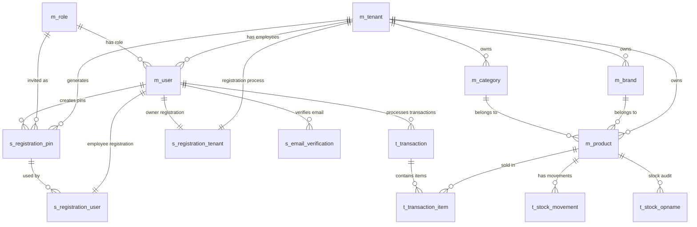

# Database Design - POS Mobile System

## Overview
Sistem Point of Sale (POS) Mobile ini dirancang dengan arsitektur multi-tenant yang mendukung banyak toko/tenant dengan user management yang kompleks. Database menggunakan MySQL dengan Prisma ORM.

## Konvensi Penamaan
Database menggunakan konvensi penamaan dengan prefix:
- **`m_`** : Master data (data referensi/utama)
- **`s_`** : Session/Security data (data sementara untuk autentikasi & registrasi)
- **`t_`** : Transactional data (data transaksi bisnis)

---

## Entity Relationship Diagram (ERD)



---

## Struktur Entitas

### 1. Master Data (m_*)

#### 1.1 m_tenant (Toko/Perusahaan)
**Deskripsi:** Tabel utama yang menyimpan informasi tenant/toko. Sistem ini multi-tenant sehingga satu database melayani banyak toko.

**Kolom Penting:**
- `tenant_id`: Primary key
- `tenant_name`: Nama toko (unique)
- `tenant_status`: Status persetujuan (PENDING, APPROVED, REJECTED, SUSPENDED)
- `is_active`: Status aktif/nonaktif
- `max_users`: Batas maksimal user per tenant (default 7)
- `approved_by`, `rejected_by`: Tracking approval oleh super admin
- `store_logo_url`: URL logo toko
- `store_business_hours`: Jam operasional

**Relasi:**
- **One-to-Many** dengan `m_user` (employee)
- **One-to-Many** dengan `m_brand`, `m_category`, `m_product`
- **One-to-One** dengan `s_registration_tenant` (proses registrasi)

---

#### 1.2 m_user (Pengguna)
**Deskripsi:** Menyimpan semua pengguna sistem termasuk super admin, owner, dan employee.

**Kolom Penting:**
- `user_id`: Primary key
- `user_name`: Username (unique)
- `user_email`: Email (unique)
- `tenant_id`: Foreign key ke tenant (null untuk super admin)
- `role_id`: Foreign key ke role
- `is_sa`: Boolean untuk Super Admin
- `is_active`: Status aktif
- `user_is_verified`: Status verifikasi email
- `user_last_login`: Waktu login terakhir
- `user_login_attempts`: Jumlah percobaan login gagal
- `user_locked_until`: Waktu lockout akun
- `registration_type`: OWNER atau EMPLOYEE
- `registration_step`: Step terakhir proses registrasi (1-4)

**Relasi:**
- **Many-to-One** dengan `m_tenant`
- **Many-to-One** dengan `m_role`
- **One-to-Many** dengan `t_transaction`, `t_cash_drawer`, `t_expense`
- **One-to-Many** dengan session & security tables

---

#### 1.3 m_role (Peran/Role)
**Deskripsi:** Mendefinisikan peran pengguna dalam sistem.

**Kolom Penting:**
- `role_id`: Primary key
- `role_name`: Nama role (unique) - contoh: "Super Admin", "Owner", "Cashier"
- `role_code`: Kode role (unique) - contoh: "SA", "OWNER", "CASHIER"
- `role_level`: Level hierarki role (0 = tertinggi)
- `is_system_role`: Boolean untuk role sistem yang tidak bisa dihapus

**Relasi:**
- **One-to-Many** dengan `m_user`

---

#### 1.4 m_brand (Brand/Merek)
**Deskripsi:** Menyimpan data brand/merek produk.

**Kolom Penting:**
- `brand_id`: Primary key
- `brand_name`: Nama brand (unique)
- `tenant_id`: Foreign key ke tenant
- `brand_logo_url`: URL logo brand

**Relasi:**
- **Many-to-One** dengan `m_tenant`
- **One-to-Many** dengan `m_product`

---

#### 1.5 m_category (Kategori Produk)
**Deskripsi:** Menyimpan kategori produk untuk klasifikasi.

**Kolom Penting:**
- `category_id`: Primary key
- `category_name`: Nama kategori
- `tenant_id`: Foreign key ke tenant

**Relasi:**
- **Many-to-One** dengan `m_tenant`
- **One-to-Many** dengan `m_product`

---

#### 1.6 m_product (Produk)
**Deskripsi:** Menyimpan informasi produk yang dijual.

**Kolom Penting:**
- `product_id`: Primary key
- `product_sku`: Stock Keeping Unit (unique)
- `product_name`: Nama produk
- `brand_id`: Foreign key ke brand (optional)
- `category_id`: Foreign key ke category (optional)
- `tenant_id`: Foreign key ke tenant
- `product_price`: Harga jual
- `product_cost`: Harga modal/cost
- `product_qty`: Jumlah stok saat ini
- `product_min_stock`: Batas minimal stok untuk alert
- `is_track_stock`: Boolean untuk tracking stok
- `is_sellable`: Boolean apakah bisa dijual

**Relasi:**
- **Many-to-One** dengan `m_tenant`, `m_brand`, `m_category`
- **One-to-Many** dengan `t_transaction_item`, `t_stock_movement`, `t_stock_opname`

---

### 2. Security & Session Data (s_*)

#### 2.1 s_email_verification
**Deskripsi:** Menyimpan kode verifikasi email untuk registrasi atau perubahan email.

**Kolom Penting:**
- `user_id`: Foreign key ke user
- `email`: Email yang diverifikasi
- `code`: Kode verifikasi (10 karakter)
- `expires_at`: Waktu kadaluarsa
- `verified`: Status verifikasi
- `type`: Jenis verifikasi (REGISTRATION, PASSWORD_RESET, EMAIL_CHANGE)

**Relasi:**
- **Many-to-One** dengan `m_user` (cascade delete)

---


**Deskripsi:** Menyimpan PIN/kode undangan untuk employee baru bergabung ke tenant.

**Kolom Penting:**
- `code`: Kode PIN (unique, 20 karakter)
- `expires_at`: Waktu kadaluarsa
- `used`: Boolean sudah digunakan atau belum
- `current_uses`: Jumlah penggunaan saat ini
- `max_uses`: Maksimal penggunaan (default 1)
- `tenant_id`: Foreign key ke tenant
- `invited_role_id`: Foreign key ke role yang diundang
- `created_by`: Foreign key ke user yang membuat PIN

**Relasi:**
- **Many-to-One** dengan `m_tenant`, `m_role`, `m_user`
- **One-to-Many** dengan `s_registration_user`

---

#### 2.3 s_registration_tenant
**Deskripsi:** Tracking proses registrasi tenant/owner (4 step).

**Kolom Penting:**
- `user_id`: Foreign key ke user (one-to-one)
- `tenant_id`: Foreign key ke tenant (one-to-one)
- `current_step`: Step saat ini (1-4)
- `temp_tenant_data`: Data sementara tenant (JSON)
- `temp_user_data`: Data sementara user (JSON)
- `registration_done`: Boolean registrasi selesai

**Relasi:**
- **One-to-One** dengan `m_user` (cascade delete)
- **One-to-One** dengan `m_tenant` (cascade delete)

---

#### 2.4 s_registration_user
**Deskripsi:** Tracking proses registrasi employee (4 step).

**Kolom Penting:**
- `user_id`: Foreign key ke user (one-to-one)
- `registration_pin_id`: Foreign key ke registration PIN
- `current_step`: Step saat ini (1-4)
- `temp_user_data`: Data sementara user (JSON)
- `registration_done`: Boolean registrasi selesai

**Relasi:**
- **One-to-One** dengan `m_user` (cascade delete)
- **Many-to-One** dengan `s_registration_pin`

---

#### 3.1 t_transaction (Transaksi Penjualan)
**Deskripsi:** Menyimpan header transaksi penjualan.

**Kolom Penting:**
- `transaction_id`: Primary key
- `tenant_id`: Foreign key ke tenant
- `transaction_cashier_id`: Foreign key ke user (cashier)
- `transaction_total`: Total transaksi
- `transaction_payment_amount`: Jumlah pembayaran
- `transaction_change_amount`: Uang kembalian
- `transaction_payment_method`: Metode pembayaran (CASH, QRIS, DEBIT)
- `transaction_status`: Status (DRAFT, LOCKED, COMPLETED, CANCELLED)
- `transaction_completed_at`: Waktu selesai
- `cash_drawer_id`: Foreign key ke cash drawer

**Relasi:**
- **Many-to-One** dengan `m_user` (cashier)
- **One-to-Many** dengan `t_transaction_item`

---

#### 3.2 t_transaction_item (Item Transaksi)
**Deskripsi:** Menyimpan detail item yang dibeli dalam transaksi.

**Kolom Penting:**
- `transaction_item_id`: Primary key
- `transaction_id`: Foreign key ke transaction
- `transaction_item_product_id`: Foreign key ke product
- `transaction_item_quantity`: Jumlah item
- `transaction_item_price`: Harga satuan
- `transaction_item_subtotal`: Subtotal (quantity × price)

**Relasi:**
- **Many-to-One** dengan `t_transaction` (cascade delete)
- **Many-to-One** dengan `m_product`

---


**Deskripsi:** Tracking semua pergerakan stok barang (masuk/keluar).

**Kolom Penting:**
- `movement_id`: Primary key
- `product_id`: Foreign key ke product
- `movement_type`: Jenis pergerakan (IN, OUT, ADJUSTMENT, RETURN)
- `quantity`: Jumlah pergerakan
- `cost_per_unit`: Harga satuan (untuk perhitungan modal)
- `reference_type`: Tipe referensi (PURCHASE, SALE, ADJUSTMENT, RETURN, OPNAME)
- `reference_id`: ID referensi dari tabel lain
- `before_qty`: Stok sebelum pergerakan
- `after_qty`: Stok setelah pergerakan
- `tenant_id`: Foreign key ke tenant

**Relasi:**
- **Many-to-One** dengan `m_product`

---


**Deskripsi:** Menyimpan hasil stock opname/audit fisik stok.

**Kolom Penting:**
- `opname_id`: Primary key
- `product_id`: Foreign key ke product
- `system_qty`: Jumlah stok di sistem
- `actual_qty`: Jumlah stok aktual (hasil hitung fisik)
- `difference`: Selisih (actual - system)
- `tenant_id`: Foreign key ke tenant
- `processed`: Boolean sudah diproses adjustment atau belum
- `processed_at`: Waktu pemrosesan

**Relasi:**
- **Many-to-One** dengan `m_product`

---

## Enumerations (ENUM)

### tenant_status
Status persetujuan tenant:
- `PENDING`: Menunggu persetujuan
- `APPROVED`: Disetujui
- `REJECTED`: Ditolak
- `SUSPENDED`: Disuspend

### registration_type
Tipe registrasi user:
- `OWNER`: Registrasi sebagai owner (dengan tenant baru)
- `EMPLOYEE`: Registrasi sebagai employee (bergabung ke tenant existing)

### verification_type
Tipe verifikasi email:
- `REGISTRATION`: Verifikasi saat registrasi
- `PASSWORD_RESET`: Verifikasi untuk reset password
- `EMAIL_CHANGE`: Verifikasi saat ganti email

### movement_type
Tipe pergerakan stok:
- `IN`: Stok masuk
- `OUT`: Stok keluar
- `ADJUSTMENT`: Penyesuaian stok
- `RETURN`: Retur barang

### reference_type
Tipe referensi pergerakan stok:
- `PURCHASE`: Dari purchase order
- `SALE`: Dari penjualan
- `ADJUSTMENT`: Dari adjustment manual
- `RETURN`: Dari retur
- `OPNAME`: Dari stock opname


### transaction_status
Status transaksi:
- `DRAFT`: Draft (belum final)
- `LOCKED`: Terkunci (sedang diproses)
- `COMPLETED`: Selesai
- `CANCELLED`: Dibatalkan

### payment_method
Metode pembayaran:
- `CASH`: Tunai
- `QRIS`: QRIS
- `DEBIT`: Kartu Debit


---

## Indeks Database

### Indeks untuk Performa
Database menggunakan banyak indeks untuk optimasi query:

1. **Foreign Keys**: Semua foreign key memiliki index
2. **Status Fields**: Field status (`is_active`, `transaction_status`, etc.) di-index
3. **Date Fields**: Field tanggal seperti `created_at`, `transaction_created_at` di-index
4. **Unique Constraints**: `user_email`, `user_name`, `tenant_name`, `product_sku`, `po_number`
5. **Composite Index**: Beberapa kombinasi field untuk query kompleks

---

## Soft Delete Pattern

Banyak tabel menggunakan soft delete pattern dengan field:
- `deleted_at`: Timestamp penghapusan (null = tidak dihapus)
- `deleted_by`: User ID yang menghapus

Tabel dengan soft delete: `m_tenant`, `m_user`, `m_role`, `m_brand`, `m_category`, `m_product`, `t_transaction`, `t_expense`

---

## Audit Trail Pattern

Sebagian besar tabel memiliki audit trail:
- `created_by`: User ID pembuat
- `created_at`: Timestamp pembuatan
- `updated_by`: User ID pengubah terakhir
- `updated_at`: Timestamp update terakhir (auto-update via `@updatedAt`)

---

## Fitur Multi-Tenancy

Sistem ini menggunakan **multi-tenancy** dengan karakteristik:

1. **Tenant Isolation**: Setiap tenant memiliki data terpisah yang di-filter via `tenant_id`
2. **Shared Schema**: Semua tenant menggunakan database yang sama
3. **Tenant-Specific Data**: Product, category, brand, transaction, dll. terikat ke `tenant_id`
4. **Cross-Tenant Data**: Role adalah data global (tidak terikat tenant)
5. **Super Admin**: User dengan `is_sa = true` dapat mengakses semua tenant

---

## Alur Bisnis Utama

### 1. Registrasi Owner & Tenant
```
1. Owner mengisi data step 1-4 → `s_registration_tenant`
2. Data tersimpan di `temp_tenant_data` dan `temp_user_data` (JSON)
3. Setelah selesai, data dipindah ke `m_tenant` dan `m_user`
4. Status tenant = PENDING
5. Super Admin approve → tenant_status = APPROVED
6. Owner bisa login dan mulai setup
```

### 2. Registrasi Employee
```
1. Owner membuat PIN → `s_registration_pin`
2. Employee input PIN dan mengisi data step 1-4 → `s_registration_user`
3. Data tersimpan di `temp_user_data` (JSON)
4. Setelah selesai, data dipindah ke `m_user`
5. Owner approve → user_is_verified = true
6. Employee bisa login
```

### 3. Flow Transaksi Penjualan
```
1. Cashier buka shift → create `t_cash_drawer` (status OPEN)
2. Customer pilih produk → create `t_transaction` (status DRAFT)
3. Add items → create `t_transaction_item`
4. Checkout & payment → update transaction (status COMPLETED)
5. Auto create `t_stock_movement` (type OUT, reference SALE)
6. Update `m_product.product_qty` (kurangi stok)
7. Update `t_cash_drawer.cash_in_transactions` (jika CASH)
8. Tutup shift → update drawer (status CLOSED/BALANCED/OVER/SHORT)
```


```
1. Count fisik stok → create `t_stock_opname`
2. Input actual_qty, system mengisi system_qty dan difference
3. Process opname → create `t_stock_movement` (type ADJUSTMENT, reference OPNAME)
4. Update `m_product.product_qty` sesuai adjustment
5. Mark `t_stock_opname.processed = true`
```

---

## Keamanan & Validasi

### 1. Authentication
- Stateless JWT token (no session tracking in database)
- Support refresh token untuk perpanjangan session

### 2. Authorization
- Role-based access control via `m_role`
- Tenant isolation via `tenant_id` filter
- Owner approval untuk employee baru

### 3. Account Security
- Login attempts tracking (`user_login_attempts`)
- Account lockout (`user_locked_until`)
- Email verification required (`user_is_verified`)

### 4. Data Integrity
- Foreign key constraints
- Cascade delete untuk data child
- Unique constraints untuk prevent duplicate

---

## Kesimpulan

Database ini dirancang untuk:
✅ **Multi-tenancy** dengan isolasi data per tenant  
✅ **Audit trail** lengkap untuk tracking perubahan  
✅ **Soft delete** untuk data recovery  
✅ **Complex registration flow** untuk owner & employee  
✅ **Complete POS features**: Transaction, Inventory, Cash Management, Reporting  
✅ **Security features**: Session management, email verification, account lockout  
✅ **Scalability**: Efficient indexing dan relasi yang optimal

Database ini siap untuk aplikasi POS mobile yang robust dan enterprise-ready! 🚀
